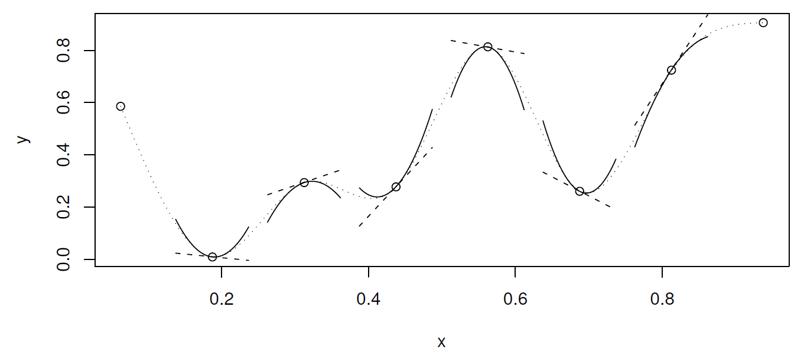

# Spline fogalma, lineáris regressziótól a spline-regresszióig

## A regresszió

```{block, type="handout"}
A regresszió legtöbb alkalmazott statisztikai terület talán legfontosabb eszköze

**Regresszió**: változók közti kapcsolat (illetve annak becslése minta alapján)

„Kapcsolat” formalizálása: függvény a matematikai fogalmával, tehát keressük az
\[
Y=f\left(X_1,X_2,\ldots,X_p\right)+\varepsilon=f\left(\mathbf{X}\right)
\]
függvényt

($Y$ eredményváltozó, $X_i$-k a magyarázó változók)
```

A regresszió legtöbb alkalmazott statisztikai terület talán legfontosabb eszköze

**Regresszió**: változók közti kapcsolat (illetve annak becslése minta alapján)

„Kapcsolat” formalizálása: függvény a matematikai fogalmával, tehát keressük az
\[
Y=f\left(X_1,X_2,\ldots,X_p\right)+\varepsilon=f\left(\mathbf{X}\right)
\]
függvényt

($Y$ eredményváltozó, $X_i$-k a magyarázó változók)

## Regresszió becslése mintából

```{block, type="handout"}
**Paraméteres regresszió**: ha *a priori* feltételezzük, hogy az $f$ függvény valamilyen -- paraméterek erejéig meghatározott -- függvényformájú (az „alakja” ismert), és így a feladat e paraméterek becslésére redukálódik

Tipikus példa a **lineáris regresszió**: $f\left(\mathbf{X}\right)=\beta_0+\beta_1 X_1 + \beta_2 X_2 + \ldots + \beta_p X_p=\mathbf{X}^T\pmb{\beta}$, így $Y=\mathbf{X}^T\pmb{\beta}+\varepsilon$

Ha rendelkezésre állnak az $\left\{y_i,\mathbf{x}_i\right\}_{i=1}^n$ megfigyeléseink a háttéreloszlásra, akkor e mintából megbecsülhetjük a paramétereket például **hagyományos legkisebb négyzetek** (OLS) módszerével:
\[
\widehat{\pmb{\beta}}=\argmin_{\mathbf{b}} \sum_{i=1}^n \left[Y_i-\mathbf{X}_i^T\mathbf{b}\right]^2=\left\| \mathbf{Y} - \mathbf{X}\mathbf{b} \right\|^2
\]

Itt tehát $\mathbf{X}$ az a mátrix, amiben a magyarázó változók elé egy csupa 1 oszlopot szúrtunk, a neve **modellmátrix** vagy design mátrix
```

**Paraméteres regresszió**: ha *a priori* feltételezzük, hogy az $f$ függvény valamilyen -- paraméterek erejéig meghatározott -- függvényformájú (az „alakja" ismert), és így a feladat e paraméterek becslésére redukálódik

Tipikus példa a **lineáris regresszió**: $f\left(\mathbf{X}\right)=\beta_0+\beta_1 X_1 + \beta_2 X_2 + \ldots + \beta_p X_p=\mathbf{X}^T\pmb{\beta}$, így $Y=\mathbf{X}^T\pmb{\beta}+\varepsilon$

Ha rendelkezésre állnak az $\left\{y_i,\mathbf{x}_i\right\}_{i=1}^n$ megfigyeléseink a háttéreloszlásra, akkor e mintából megbecsülhetjük a paramétereket például **hagyományos legkisebb négyzetek** (OLS) módszerével:
\[
\widehat{\pmb{\beta}}=\argmin_{\mathbf{b}} \sum_{i=1}^n \left[Y_i-\mathbf{X}_i^T\mathbf{b}\right]^2=\left\| \mathbf{Y} - \mathbf{X}\mathbf{b} \right\|^2
\]

Itt tehát $\mathbf{X}$ az a mátrix, amiben a magyarázó változók elé egy csupa 1 oszlopot szúrtunk, a neve **modellmátrix** vagy design mátrix

## Paraméteres és nem-paraméteres regresszió

```{block, type="handout"}
De cserében mindig ott lebeg felettünk a kérdés, hogy a függvényformára *jó feltételezést* tettünk-e (hiszen ez nem az adatokból következik, ezt „ráerőszakoljuk” az adatokra)

(Persze ezért van a modelldiagnosztika)

A nem-paraméteres regresszió *flexibilis*, olyan értelemben, hogy minden a priori megkötés nélkül követi azt, ami az adatokból következik (a valóság ritkán lineáris?)

Cserében nehezebb becsülni, és nem kapunk analitikus -- jó esetben valamire hasznosítható -- regressziós függvényt, nem lehet értelmesen interpolálni és extrapolálni („fordul a kocka" a paraméteres esethez képest)
```

De cserében mindig ott lebeg felettünk a kérdés, hogy a függvényformára *jó feltételezést* tettünk-e (hiszen ez nem az adatokból következik, ezt „ráerőszakoljuk” az adatokra)

(Persze ezért van a modelldiagnosztika)

A nem-paraméteres regresszió *flexibilis*, olyan értelemben, hogy minden a priori megkötés nélkül követi azt, ami az adatokból következik (a valóság ritkán lineáris?)

Cserében nehezebb becsülni, és nem kapunk analitikus -- jó esetben valamire hasznosítható -- regressziós függvényt, nem lehet értelmesen interpolálni és extrapolálni („fordul a kocka" a paraméteres esethez képest)

## A lineáris regresszió kibővítése, nemlinearitások

```{block, type="handout"}
Maradva a paraméteres keretben, arra azért mód van, hogy a függvényformát kibővítsük (és így flexibilisebbé tegyük)

Ezzel a különféle **nemlineáris regressziókhoz** jutunk el

E nemlinearitásoknak két alaptípusa van

-   Változójában nemlineáris modell (pl. $\beta_0 + \beta_1 x + \beta_2 x^2$): csak a szó „matematikai értelmében” nemlineáris, ugyanúgy becsülhető OLS-sel

-   Paraméterében nemlineáris modell (pl. $\beta_0x_1^{\beta_1}x_2^{\beta_2}$): felrúgja a lineáris struktúrát, így érdemileg más, csak linearizálás után, vagy NLS-sel becsülhető

Mi most az első esettel fogunk foglalkozni

Az itt látott „polinomiális regresszió” valóban nagyon gyakori módszer a flexibilitás növelésére
```

Maradva a paraméteres keretben, arra azért mód van, hogy a függvényformát kibővítsük (és így flexibilisebbé tegyük)

Ezzel a különféle **nemlineáris regressziókhoz** jutunk el

E nemlinearitásoknak két alaptípusa van

-   Változójában nemlineáris modell (pl. $\beta_0 + \beta_1 x + \beta_2 x^2$): csak a szó „matematikai értelmében” nemlineáris, ugyanúgy becsülhető OLS-sel

-   Paraméterében nemlineáris modell (pl. $\beta_0x_1^{\beta_1}x_2^{\beta_2}$): felrúgja a lineáris struktúrát, így érdemileg más, csak linearizálás után, vagy NLS-sel becsülhető

Mi most az első esettel fogunk foglalkozni

Az itt látott „polinomiális regresszió” valóban nagyon gyakori módszer a flexibilitás növelésére

## Egy példa

```{block, type="handout"}
Tekintsünk most egy másik példát, egy zajos másodfokú függvényt, kevesebb pontból:
```

Tekintsünk most egy másik példát, egy zajos másodfokú függvényt, kevesebb pontból:

```{r}
n <- 20
x <- runif(n, 0, 10)
xgrid <- seq(0, 10, length.out = 100)
ygrid <- xgrid^2
yobs <- x^2 + rnorm(n, 0, 5)
SimData <- data.frame(x, xgrid, ygrid, yobs)
p <- ggplot(SimData) + geom_point(aes(x = x, y = yobs)) +
  geom_line(aes(x = xgrid, y = ygrid), color = "orange", lwd = 1)
p
```

## Regresszió ötödfokú polinommal

```{r}
fit5 <- lm(yobs ~ poly(x, 5), data = SimData)
p + geom_line(data = data.frame(xgrid, pred = predict(fit5, data.frame(x = xgrid))),
              aes(x = xgrid, y = pred))
```

## Módosítás

```{block, type="handout"}
Mondjuk, hogy nagyobb flexibilitásra vágyunk

-   Például figyelembe akarjuk venni, hogy ez nem tűnik teljesen lineárisnak, vagy meg akarjuk ragadni a finomabb tendenciákat is

Emeljük a polinom fokszámát (ez nyilván növeli a flexibilitást, hiszen a kisebb fokszám nyilván speciális eset lesz), például 10-re

Szokás azt mondani, hogy a rang 5 illetve 10 (a polinom fokszáma, a becsülendő paraméterek száma nyilván egyezik a modellmátrix rangjával, de ez a fogalom később, amikor nem is polinomunk van, akkor is használható)
```

Mondjuk, hogy nagyobb flexibilitásra vágyunk

-   Például figyelembe akarjuk venni, hogy ez nem tűnik teljesen lineárisnak, vagy meg akarjuk ragadni a finomabb tendenciákat is

Emeljük a polinom fokszámát (ez nyilván növeli a flexibilitást, hiszen a kisebb fokszám nyilván speciális eset lesz), például 10-re

Szokás azt mondani, hogy a rang 5 illetve 10 (a polinom fokszáma, a becsülendő paraméterek száma nyilván egyezik a modellmátrix rangjával, de ez a fogalom később, amikor nem is polinomunk van, akkor is használható)

## Regresszió tizedfokú polinommal

```{r}
fit10 <- lm(yobs ~ poly(x, 10), data = SimData)
p + geom_line(data = data.frame(xgrid, pred = predict(fit10, data.frame(x = xgrid))),
              aes(x = xgrid, y = pred))
```

## Mi a jelenség oka?

```{block, type="handout"}
Szokás azt mondani, hogy *túlilleszkedés*, ami persze igaz is, de itt többről van szó

A polinomok elsősorban *lokálisan* tudnak jól közelíteni (a Taylor-sorfejtéses érvelés miatt), de nekünk arra lenne szükségünk, hogy *globálisan* jól viselkedő függvényformát találjunk

Pedig a polinomokat amúgy szeretjük, többek között azért is, mert szép sima görbét írnak le (matematikai értelemben véve a simaságot: végtelenszer folytonosan deriválhatóak, $C^{\infty}$-beliek)

Mi lehet akkor a megoldás?
```

Szokás azt mondani, hogy *túlilleszkedés*, ami persze igaz is, de itt többről van szó

A polinomok elsősorban *lokálisan* tudnak jól közelíteni (a Taylor-sorfejtéses érvelés miatt), de nekünk arra lenne szükségünk, hogy *globálisan* jól viselkedő függvényformát találjunk

Pedig a polinomokat amúgy szeretjük, többek között azért is, mert szép sima görbét írnak le (matematikai értelemben véve a simaságot: végtelenszer folytonosan deriválhatóak, $C^{\infty}$-beliek)

Mi lehet akkor a megoldás?

## Mi lehet a megoldás?

```{block, type="handout"}
Egy lehetséges megközelítés: „összerakjuk a globálisat több lokálisból”

Azaz szakaszokra bontjuk a teljes intervallumot, és mindegyiket *külön-külön* polinommal igyekszünk modellezni

Így próbáljuk kombinálni a két módszer előnyeit

Persze a szakaszosan definiált polinomok önmagában még nem jók: a szakaszhatárokon találkozniuk kell (e találkozópontok neve: **knot**, „csomópont”, a számukat $q-2$-val jelöljük, a pozíciójukat $x_i^{\ast}$-vel)

Sőt, ha a simasági tulajdonságokat is át akarjuk vinni, akkor az érintkezési pontokban a deriváltaknak (magasabbrendűeknek is) is egyezniük kell

Ha $p$-edfokú polinomokat használunk, akkor az első $p-1$ derivált -- és persze a függvényérték -- egyezését kell kikötnünk a knot-okban (és esetleg még valamit a végpontokra)

Ez így már jó konstrukció lesz, a neve: **spline**
```

Egy lehetséges megközelítés: „összerakjuk a globálisat több lokálisból”

Azaz szakaszokra bontjuk a teljes intervallumot, és mindegyiket *külön-külön* polinommal igyekszünk modellezni

Így próbáljuk kombinálni a két módszer előnyeit

Persze a szakaszosan definiált polinomok önmagában még nem jók: a szakaszhatárokon találkozniuk kell (e találkozópontok neve: **knot**, „csomópont”, a számukat $q-2$-val jelöljük, a pozíciójukat $x_i^{\ast}$-vel)

Sőt, ha a simasági tulajdonságokat is át akarjuk vinni, akkor az érintkezési pontokban a deriváltaknak (magasabbrendűeknek is) is egyezniük kell

Ha $p$-edfokú polinomokat használunk, akkor az első $p-1$ derivált -- és persze a függvényérték -- egyezését kell kikötnünk a knot-okban (és esetleg még valamit a végpontokra)

Ez így már jó konstrukció lesz, a neve: **spline**

## Természetes köbös spline

```{block, type="handout"}
(Azért köbös, mert harmadfokúak a polinomok, és azért természetes, mert azt kötöttük ki, hogy a végpontokban nulla legyen a második derivált)
```

(Azért köbös, mert harmadfokúak a polinomok, és azért természetes, mert azt kötöttük ki, hogy a végpontokban nulla legyen a második derivált)



## A példa regressziója természetes köbös spline-nal

```{r}
fitSpline <- lm(yobs ~ splines::ns(x, 10), data = SimData)
p + geom_line(data = data.frame(xgrid, pred = predict(fitSpline, data.frame(x = xgrid))),
              aes(x = xgrid, y = pred))
```

## Mi az előbbiben a fantasztikus?

```{r}
p + geom_line(data = rbind(data.frame(type = "Ötödfokú polinom",
                                      pred = predict(fit5, data.frame(x = xgrid)), xgrid),
                           data.frame(type = "Tizedfokú polinom",
                                      pred = predict(fit10, data.frame(x = xgrid)), xgrid),
                           data.frame(type = "Spline",
                                      pred = predict(fitSpline, data.frame(x = xgrid)),
                                      xgrid)),
              aes(x = xgrid, y = pred, color = type)) + labs(color = "")
```

## A spline-regresszió ereje

```{block, type="handout"}
Nem csak az a jó, hogy szépen illeszkedik (tulajdonképpen még annál is jobban, mint a tizedfokú polinom, még ott is, ahol az jól illeszkedik amúgy)

...hanem, hogy -- most már elárulhatom -- *ez is ugyanúgy 10 rangú* mint a tizedfokú polinom!

Mégis: nyoma nincs túlilleszkedésnek
```

Nem csak az a jó, hogy szépen illeszkedik (tulajdonképpen még annál is jobban, mint a tizedfokú polinom, még ott is, ahol az jól illeszkedik amúgy)

...hanem, hogy -- most már elárulhatom -- *ez is ugyanúgy 10 rangú* mint a tizedfokú polinom!

Mégis: nyoma nincs túlilleszkedésnek